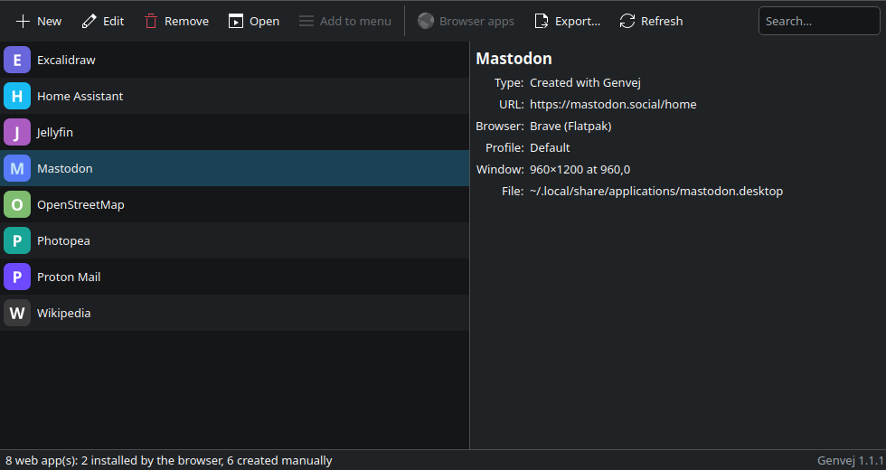
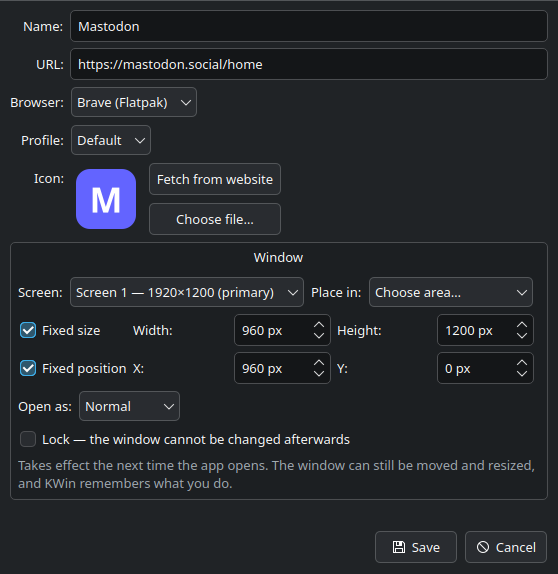

# Genvej

Turn websites into real desktop apps on Linux — and clean them up again.

Genvej (Danish for *shortcut*) is a small Qt 6 program that gathers all your web apps
in one place: the ones you create yourself from a URL, and the ones your Chromium-based
browser installed as PWAs. Other web app managers only see the shortcuts they created
themselves; Genvej finds all of them, because it reads the `.desktop` files directly.



## Features

- Create a web app from a URL — pick the browser, profile and icon
- Fetch the icon automatically from the website (favicon, apple-touch-icon or manifest)
- List every existing web app, no matter who created it
- Rename and change the icon, including on PWAs the browser installed itself
- Choose how the app's window opens — halves, quarters, maximized or full screen, on the
  screen of your choice (requires KDE Plasma)
- Move a web app from the desktop into the application menu — Brave installed as a Snap
  can only put its PWAs on the desktop
- Remove a web app completely, including its icon files and window rule
- Open the browser's apps page in the right profile, for when a PWA needs to be
  uninstalled in the browser as well
- Roll web apps out from the command line, so a management tool can deploy them
  across a fleet

<p align="center">
  
</p>

## Requirements

- Linux with a freedesktop-compliant desktop (KDE Plasma, GNOME, …)
- `python3` and `PySide6`
- At least one Chromium-based browser

Window size and placement use KWin window rules and are only available on KDE Plasma.
Everything else works on any desktop.

PySide6 is already included on Fedora Atomic desktops such as Kinoite and Bazzite.
Elsewhere:

| Distribution | Command |
| --- | --- |
| Fedora | `sudo dnf install python3-pyside6` |
| Ubuntu / Debian | `sudo apt install python3-pyside6.qtcore python3-pyside6.qtgui python3-pyside6.qtwidgets` |

There are no third-party Python packages, no build step and no virtualenv, so Genvej runs
directly on immutable systems without layering packages.

## Installation

Download **Source code (tar.gz)** from the
[latest release](https://github.com/MrNielsenDK/genvej/releases/latest), then unpack it
and run the installer:

```bash
tar xf genvej-*.tar.gz
cd genvej-*/
./install.sh
```

The installer puts everything under `~/.local` and does not need root. Start Genvej from
the application menu or by running `genvej`. The unpacked folder can be deleted afterwards.

To install Genvej once for everybody on the machine — including users created later —
run it with `--system`, which installs into `/usr/local` and needs root:

```bash
sudo ./install.sh --system
```

`--prefix=DIR` installs the same layout somewhere else.

To run the latest development version instead, clone the repository:

```bash
git clone https://github.com/MrNielsenDK/genvej.git
cd genvej
./install.sh
```

### Updating

Download the new release and run its `./install.sh`. It replaces the installed copy and
leaves your web apps and window rules alone. Check which version you have with
`genvej --version`, or look in the bottom right corner of the main window.

### Uninstalling

Run `./uninstall.sh` from the unpacked folder or clone. Your web apps are left in place.
It takes the same `--system` and `--prefix=DIR` options as the installer.

## Command line

The same work the window does is available without one, so web apps can be deployed
by a management tool. Every subcommand writes JSON to standard output and exits
non-zero if anything failed.

```bash
genvej list                        # every web app found
genvej apply --manifest apps.json  # create, update and remove from a manifest
genvej remove --url https://intranet.example.com/
```

A manifest looks like this:

```json
{
  "version": 1,
  "webapps": [
    {
      "id": "intranet",
      "name": "Intranet",
      "url": "https://intranet.example.com/",
      "browser": "brave",
      "profile": "Default",
      "icon": "auto",
      "window": { "state": "maximized" }
    },
    {
      "id": "old-timesheet",
      "name": "Timesheet",
      "url": "https://timesheet.example.com/",
      "state": "absent"
    }
  ]
}
```

Only `name` and `url` are required. `browser` takes a browser's ident — `brave`,
`chrome`, `chromium`, `edge`, `vivaldi`, optionally suffixed `-snap` or `-flatpak` —
and `auto`, the default, takes whichever Chromium-based browser is installed; a bare
`brave` also matches the snap and the flatpak, so one manifest covers a mixed fleet.
`icon` is `auto` to fetch it from the site, a URL, a path, or `keep` to leave it alone.
`state` is `present` (the default) or `absent`. Applying the same manifest twice
changes nothing the second time: entries are matched on their URL, so a renamed web
app is still recognised.

The `window` block takes `state` (`maximized` or `fullscreen`), explicit `size` and
`position` as `[x, y]` pixel pairs, `lock` to force the geometry rather than remember
it, and `area` with `screen` for a named fraction such as `Left half`. A named area is
measured against a real screen, so it is skipped — and said so in the output — when
Genvej runs with no session to measure, as it does when a management tool applies the
manifest in the background. Explicit pixels and the two states work either way.

## Supported browsers

Brave, Google Chrome, Chromium, Microsoft Edge and Vivaldi — as a system package or a
Flatpak. Brave and Chromium are also supported as a Snap.

Firefox is not supported, since it has no equivalent of Chromium's `--app=` mode.

## How it works

Genvej keeps no database of its own. Every time the list is refreshed, it scans
`~/.local/share/applications`, the Flatpak browsers' application directories and the
desktop for `.desktop` files whose `Exec` line contains `--app=` or `--app-id=`.

- **`--app=<url>`** is a regular shortcut. Genvej can edit everything about it.
- **`--app-id=<id>`** is a PWA the browser installed itself. The URL lives inside the
  browser profile, so Genvej only changes the name and icon. Removing it deletes the
  shortcut, but the browser may restore it — uninstall it on the browser's apps page
  (e.g. `brave://apps`) as well.

Window size, position and state are written as rules to KWin's `kwinrulesrc`, the same file
KDE's own window rules editor uses. Rules made by others are left alone. A rule takes
effect the next time the app's window opens.

## Known limitations

- A web app cannot minimize to the system tray when closed. The close button is handled
  inside the browser, and Wayland gives outside programs no way to intercept it.
- The user interface is English only.

## License

Genvej is free software, licensed under the
[GNU General Public License v3.0 or later](LICENSE).
